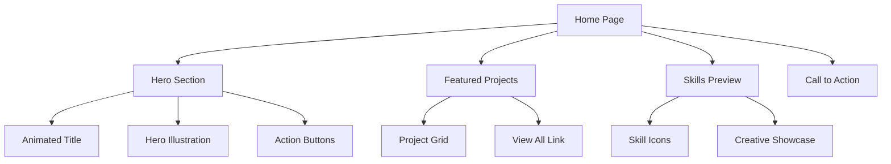
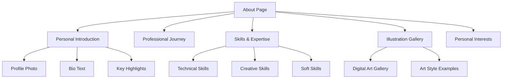
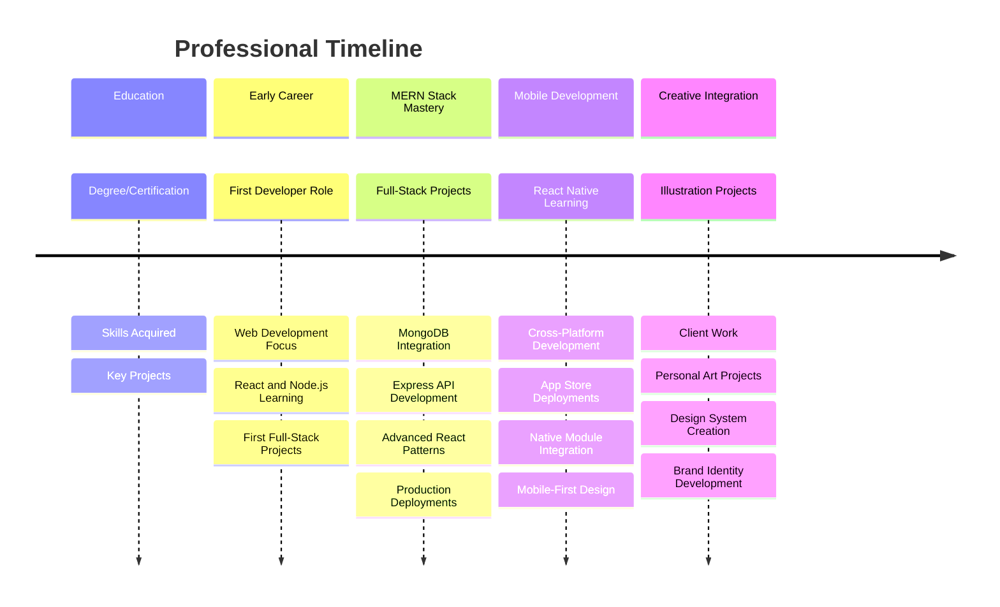

# Software Developer Portfolio Website Design

## Overview

A creative, responsive portfolio website designed to showcase software development projects and digital illustration skills to attract potential employers. The portfolio combines technical expertise with artistic creativity, creating a unique personal brand that stands out in the competitive tech industry.

**Primary Goals:**
- Showcase MERN stack and React Native development expertise
- Highlight full-stack mobile development capabilities
- Demonstrate digital illustration skills as a creative differentiator
- Attract potential employers seeking versatile full-stack mobile developers
- Establish a strong personal brand combining technical versatility with creativity

**Target Audience:**
- Tech recruiters seeking MERN stack developers
- Mobile app development companies and startups
- Full-stack development teams and agencies
- Clients needing end-to-end web and mobile solutions
- Fellow developers and creative professionals

## Technology Stack & Dependencies

**Frontend Framework:**
- React 18+ (with hooks and functional components)
- TypeScript for type safety and better development experience

**Styling & UI:**
- Tailwind CSS for utility-first styling
- Framer Motion for smooth animations and transitions
- React Icons for consistent iconography
- Custom CSS for unique creative elements

**Additional Libraries:**
- React Router DOM for navigation
- React Hook Form for contact form handling
- EmailJS for contact form submissions
- Intersection Observer API for scroll animations
- React Helmet for SEO optimization

**Build Tools:**
- Vite for fast development and building
- ESLint and Prettier for code quality
- PostCSS for CSS processing

## Component Architecture

### Component Hierarchy

```
App
├── Layout
│   ├── Header
│   │   ├── Navigation
│   │   └── MobileMenuToggle
│   └── Footer
├── Pages
│   ├── Home
│   │   ├── HeroSection
│   │   ├── FeaturedProjects
│   │   └── CallToAction
│   ├── About
│   │   ├── PersonalIntro
│   │   ├── SkillsOverview
│   │   └── IllustrationShowcase
│   ├── Skills
│   │   ├── TechnicalSkills
│   │   ├── CreativeSkills
│   │   └── SkillsVisualization
│   ├── Experience
│   │   ├── WorkExperience
│   │   ├── ProjectExperience
│   │   └── Timeline
│   └── Contact
│       ├── ContactForm
│       ├── ContactInfo
│       └── SocialLinks
├── Components
│   ├── ProjectCard
│   ├── SkillBadge
│   ├── AnimatedSection
│   ├── LoadingSpinner
│   └── ScrollToTop
└── Utils
    ├── animations.js
    └── constants.js
```

### Core Components Definition

#### Header Component
```typescript
interface HeaderProps {
  isScrolled: boolean;
  currentSection: string;
}

Features:
- Fixed navigation with background blur on scroll
- Active section highlighting
- Smooth scroll to sections
- Mobile hamburger menu with slide-out animation
- Logo/brand integration
```

#### HeroSection Component
```typescript
interface HeroSectionProps {
  name: string;
  title: string;
  subtitle: string;
  heroImage?: string;
}

Features:
- Animated typewriter effect for title
- Custom illustrated background or hero image
- Floating animation elements
- Call-to-action buttons with hover effects
- Parallax scrolling background
```

#### ProjectCard Component
```typescript
interface ProjectCardProps {
  project: {
    id: string;
    title: string;
    description: string;
    technologies: string[];
    imageUrl: string;
    liveUrl?: string;
    githubUrl?: string;
    appStoreUrl?: string;
    playStoreUrl?: string;
    category: 'frontend' | 'backend' | 'fullstack' | 'mobile' | 'illustration' | 'hybrid';
    platform?: 'web' | 'mobile' | 'both';
  };
  index: number;
}

Features:
- Hover animations and overlays
- Technology stack badges (MERN, React Native, etc.)
- Image gallery for mobile app screenshots
- Multiple link types (live demo, GitHub, app stores)
- Platform-specific icons (web, iOS, Android)
- Category-based filtering with MERN and mobile focus
```

#### SkillsVisualization Component
```typescript
interface SkillsVisualizationProps {
  skills: {
    frontend: Skill[]; // React, TypeScript, Tailwind
    backend: Skill[];  // Node.js, Express, MongoDB
    mobile: Skill[];   // React Native, Expo, native modules
    creative: Skill[]; // Digital illustration, design tools
    tools: Skill[];    // Git, AWS, CI/CD, testing
  };
}

Features:
- Interactive MERN stack visualization
- Mobile development skill showcase
- React Native competency indicators
- Creative animations on hover
- Skill interconnection diagrams showing full-stack flow
- Custom illustrations for each technology category
```

### State Management

**Local State Management:**
- useState for component-level state (forms, toggles, animations)
- useReducer for complex state logic (filtering, sorting)
- Custom hooks for reusable stateful logic

**Global State (Context API):**
```typescript
interface AppContextType {
  theme: 'light' | 'dark';
  language: 'en' | 'es' | 'fr';
  currentSection: string;
  isLoading: boolean;
  projects: Project[];
  skills: Skills;
}
```

### Component Props & Interfaces

```typescript
interface Project {
  id: string;
  title: string;
  description: string;
  longDescription?: string;
  technologies: Technology[];
  imageUrl: string;
  galleryImages?: string[];
  liveUrl?: string;
  githubUrl?: string;
  appStoreUrl?: string;
  playStoreUrl?: string;
  category: ProjectCategory;
  platform: 'web' | 'mobile' | 'both';
  featured: boolean;
  date: string;
  metrics?: {
    users?: number;
    downloads?: number;
    performance?: string;
  };
}

interface Skill {
  name: string;
  level: number; // 1-5 or percentage
  icon: string;
  category: SkillCategory;
  description?: string;
}

interface Experience {
  id: string;
  company: string;
  position: string;
  duration: string;
  description: string[];
  technologies: string[];
  type: 'work' | 'freelance' | 'project';
  achievements?: string[];
  stack: 'frontend' | 'backend' | 'fullstack' | 'mobile' | 'hybrid';
}
```

## Routing & Navigation

**Route Structure:**
```typescript
const routes = [
  { path: '/', component: Home, exact: true },
  { path: '/about', component: About },
  { path: '/skills', component: Skills },
  { path: '/experience', component: Experience },
  { path: '/contact', component: Contact },
  { path: '/project/:id', component: ProjectDetail },
  { path: '*', component: NotFound }
];
```

**Navigation Features:**
- Single Page Application (SPA) with React Router
- Smooth scroll navigation between sections
- Active navigation highlighting
- Breadcrumb navigation for project details
- Browser back/forward button support
- Deep linking for specific projects

**Mobile Navigation:**
- Hamburger menu with slide-out drawer
- Touch-friendly navigation elements
- Swipe gestures for project galleries
- Collapsible sections for better mobile UX

## Styling Strategy

**Tailwind CSS Configuration:**
```javascript
module.exports = {
  theme: {
    extend: {
      colors: {
        primary: {
          50: '#f0f9ff',
          500: '#3b82f6',
          900: '#1e3a8a'
        },
        creative: {
          purple: '#8b5cf6',
          pink: '#ec4899',
          orange: '#f97316'
        }
      },
      fontFamily: {
        sans: ['Inter', 'system-ui'],
        display: ['Space Grotesk', 'system-ui'],
        code: ['Fira Code', 'monospace']
      },
      animation: {
        'float': 'float 6s ease-in-out infinite',
        'typewriter': 'typewriter 2s steps(20) forwards',
        'fade-in': 'fadeIn 0.5s ease-out forwards'
      }
    }
  }
}
```

**Design System:**
- Custom color palette reflecting creativity and professionalism
- Typography scale with display fonts for headings
- Consistent spacing and sizing system
- Custom animations and transitions
- Responsive breakpoints for all device sizes

**Creative Elements:**
- Custom SVG illustrations and icons
- Gradient backgrounds and overlays
- Morphing shapes and floating elements
- Interactive hover states and micro-animations
- Creative loading animations

## Page-Specific Architecture

### Home Page Structure



**Hero Section Features:**
- Large, eye-catching headline: "Full-Stack Mobile Developer & Digital Artist"
- Custom digital illustration showcasing both code and creative elements
- Brief introduction highlighting MERN + React Native expertise
- Action buttons (View Projects, Mobile Apps, Contact Me, Download Resume)
- Animated technology icons (MongoDB, Express, React, Node.js, React Native)
- Subtle particle animation representing data flow

**Featured Projects Section:**
- 3-4 carefully selected projects demonstrating range:
  - E-commerce MERN stack web application
  - React Native mobile app with backend integration
  - Full-stack project with real-time features (Socket.io)
  - Creative project combining development and illustration
- Interactive project cards with live previews
- Technology stack visualization for each project
- App store badges and download metrics for mobile apps
- GitHub stars and contribution statistics

### About Page Structure



**Content Strategy:**
- Professional story emphasizing full-stack mobile development journey
- Narrative about transitioning between web and mobile development
- Emphasis on unique combination of MERN expertise, React Native skills, and creative abilities
- Custom illustrations showing development workflow and creative process
- Downloadable resume highlighting technical stack and project achievements
- Personal interests connecting technology and art

### Skills Page Structure

**MERN Stack Skills:**
- Frontend: React.js, Redux/Context API, TypeScript, Tailwind CSS
- Backend: Node.js, Express.js, RESTful APIs, GraphQL
- Database: MongoDB, Mongoose ODM, database design and optimization
- Authentication: JWT, OAuth, session management

**React Native & Mobile:**
- Cross-platform mobile development with React Native
- Expo framework and managed workflow
- Native modules integration (iOS/Android)
- Mobile UI/UX patterns and navigation
- App store deployment and distribution
- Performance optimization for mobile devices

**Full-Stack Integration:**
- End-to-end application architecture
- API design and integration
- Real-time features (Socket.io, WebSockets)
- Cloud deployment (AWS, Heroku, Vercel)
- CI/CD pipelines and automated testing

**Creative Skills Categories:**
- Digital Illustration (software, techniques, styles)
- Design Tools (Adobe Creative Suite, Figma)
- Art Styles (character design, landscapes, logos)
- Animation and Motion Graphics

**Interactive Elements:**
- MERN stack flow visualization showing data flow from MongoDB to React
- React Native component tree interactive diagram
- Skill level indicators with project examples
- Hover effects showing related projects and technologies
- Technology ecosystem map showing how skills interconnect
- Mobile development timeline and learning journey

### Experience Page Structure



**Timeline Features:**
- Interactive timeline highlighting MERN stack progression
- Mobile development milestones and app launches
- Technology adoption journey (from vanilla JS to full MERN)
- Creative project integration throughout career
- Quantifiable achievements (app downloads, user engagement, performance metrics)
- Open source contributions and community involvement

### Contact Page Structure

**Contact Form Features:**
- Clean, accessible form design
- Real-time validation and feedback
- Multiple contact methods (email, social media)
- Custom success/error animations
- Spam protection and rate limiting

**Additional Elements:**
- Professional headshot or custom avatar
- Social media integration
- Location and availability information
- Response time expectations
- Creative contact animation or illustration

## API Integration Layer

**EmailJS Integration:**
```typescript
interface ContactFormData {
  name: string;
  email: string;
  subject: string;
  message: string;
  projectType: 'web-development' | 'mobile-app' | 'fullstack' | 'illustration' | 'consultation';
  budget?: string;
  timeline?: string;
  platform?: 'web' | 'ios' | 'android' | 'both';
}

const sendEmail = async (formData: ContactFormData) => {
  try {
    const result = await emailjs.send(
      'service_id',
      'template_id',
      formData,
      'public_key'
    );
    return result;
  } catch (error) {
    throw new Error('Failed to send message');
  }
};
```

**Content Management:**
- Static JSON files for project data
- Dynamic import for code examples
- Image optimization and lazy loading
- SEO metadata management

## Testing Strategy

**Unit Testing:**
- Jest and React Testing Library for component testing
- Custom hooks testing with renderHook
- Utility function testing
- Form validation testing

**Integration Testing:**
- Page-level component integration
- Router navigation testing
- Form submission workflows
- API integration testing

**Visual Testing:**
- Responsive design testing across devices
- Cross-browser compatibility
- Accessibility testing with axe-core
- Performance testing with Lighthouse

**Test Coverage Areas:**
- Component rendering and props
- User interactions and events
- Form submissions and validations
- Navigation and routing
- Animation and transition states
- Responsive behavior
- Accessibility compliance

## Performance Optimization

**Code Splitting:**
- Route-based code splitting with React.lazy
- Component lazy loading for heavy elements
- Dynamic imports for illustrations

**Image Optimization:**
- WebP format with fallbacks
- Responsive images with srcset
- Lazy loading with Intersection Observer
- Image compression and optimization

**Bundle Optimization:**
- Tree shaking for unused code
- Minification and compression
- CSS purging with Tailwind
- Service worker for caching

**SEO Optimization:**
- Meta tags and Open Graph data
- Structured data markup
- Sitemap generation
- Performance-focused loading strategies